# 数字图像处理大作业

需要做的是轮廓检测

## 结果说明

在`result`文件夹里存放了各种方法处理出的结果，文件夹结构如下：

```
├─deeplearning
│  ├─denoise
│  │  ├─dexined
│  │  │  ├─avg
│  │  │  └─fused
│  │  └─teed
│  │      └─fused
│  ├─denoise+emboss
│  │  ├─dexined
│  │  │  ├─avg
│  │  │  └─fused
│  │  └─teed
│  │      └─fused
│  ├─denoise+hp
│  │  ├─dexined
│  │  │  ├─avg
│  │  │  └─fused
│  │  └─teed
│  │      └─fused
│  ├─denoise+laplacian
│  │  ├─dexined
│  │  │  ├─avg
│  │  │  └─fused
│  │  └─teed
│  │      └─fused
│  └─direct
│      ├─dexined
│      │  ├─avg
│      │  └─fused
│      └─teed
│          └─fused
└─tradition
    ├─canny
    ├─denoise+sobel
    └─sobel
```

分为传统方法和深度学习方法3

## 传统方法

### sobel

首先想到的是使用sobel算子，直接使用sobel算子进行图像处理，在`preprocess.ipynb`里面实现，处理的结果存放在`result\tradition\sobel`中，产生的部分结果如下：

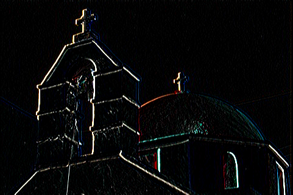

### denoise+sobel

上图看到存在噪声，使用高斯滤波进行去噪，然后再使用sobel算子进行图像处理，也在`preprocess.ipynb`里面实现，处理的结果存放在`result\tradition\denoise+sobel`中，产生的部分结果如下：

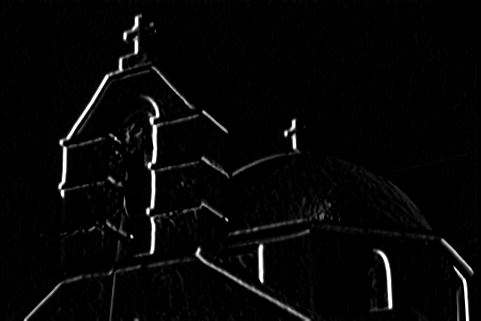


### canny算法

canny算法的结果其实相当不错

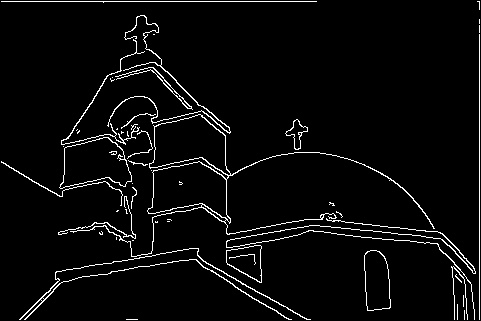

处理的结果存放在`result\tradition\canny`中


感觉传统的方法不是很有效，选用了深度学习的方法，采用了DexiNed和TEED两种模型

## direct

将测试图片直接输入，产生的部分结果如下：

dexined

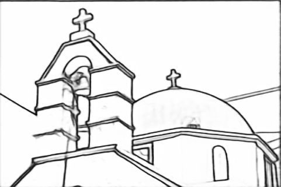

teed

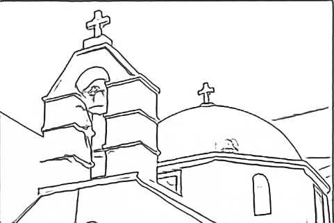

两种模型对于图像轮廓的描绘结果都还可以

结果存放地址在`result\deeplearning\direct`中

## denoise

从上面两张图片中可以看到仍有一部分细节被当作轮廓描绘出来，采用传统中的去噪处理后的图片作为输入

dexined

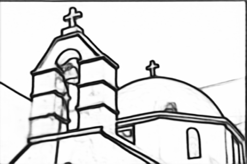

teed


降噪造成边缘模糊，描绘不清楚

结果存放地址在`result\deeplearning\denoise`中

## denoise+high pass

降噪之后使用高通锐化边缘

dexined

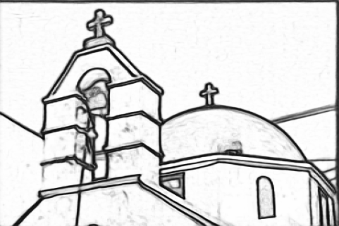

teed


dexined的效果其实还可以，但是噪点也变多了

high pass会放大细节，其他图片的很多细节就一起被描进去了

结果存放地址在`result\deeplearning\denoise+hp`

## denoise+emboss

找到一种产生浮雕感的卷积核，产生的图片边缘感觉就比较清晰，拿来试一试

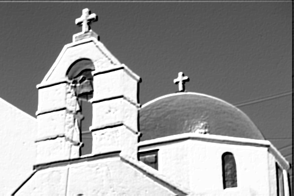

其实处理之后的图片可以看出左边建筑与围墙之间的界限被抹平，轮廓也很难被描绘出来+

卷积核如下

```python
emboss_kernel=np.array([[-2, -1, 0],
                 [-1,  1, 1],
                 [ 0,  1, 2]])
```

dexined

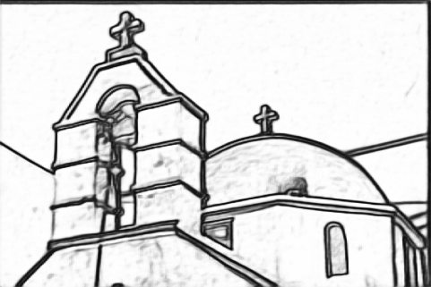

teed

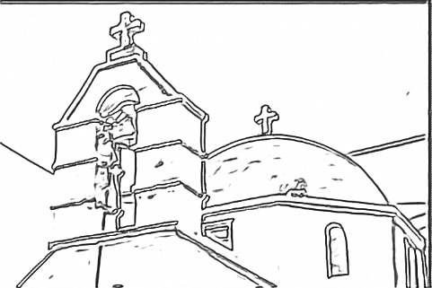

teed对于其他图片的处理其实还可以

结果存放地址在`result\deeplearning\denoise+emboss`

## denoise+laplacian

[第三章 灰度变换与空间滤波-（六）锐化空间滤波器之拉普拉斯算子 - 知乎 (zhihu.com)](https://zhuanlan.zhihu.com/p/79019891)

参考了这一篇，在去噪后使用laplacian算子和叠加公式处理

dexined

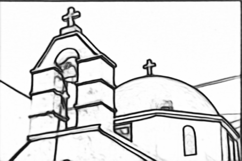

teed

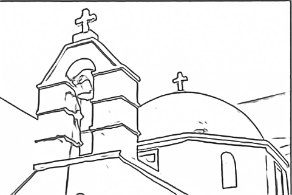

综合来看这种方法的效果最好

结果存放地址在`result\deeplearning\denoise+laplacian`


上传容量限制，**没有提交模型的checkpoint**

使用的两个模型地址

>[xavysp/DexiNed: DexiNed: Dense EXtreme Inception Network for Edge Detection (github.com)](https://github.com/xavysp/DexiNed)
>
>[xavysp/TEED: TEED: Tiny and Efficient Edge Detector (github.com)](https://github.com/xavysp/TEED)


